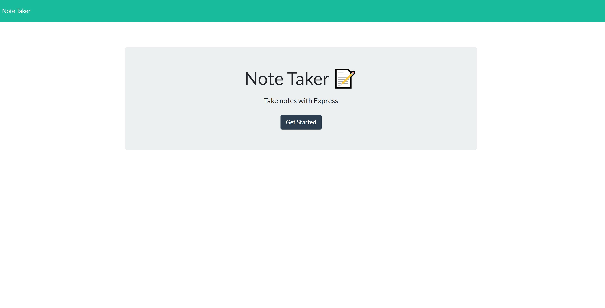
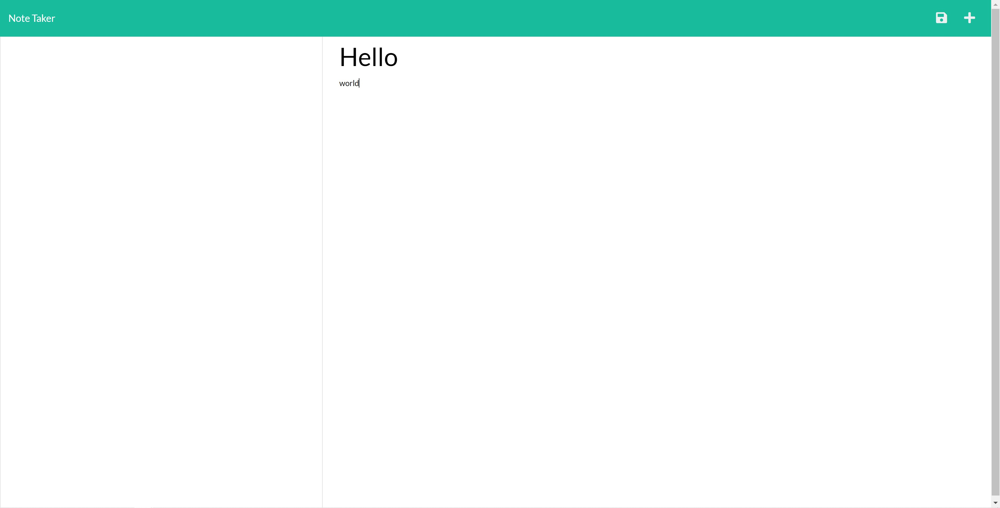

# Note Taker
## Table of Contents
----------------------------------------------------------------
- ## [Description](#Description)
- ## [Usage](#usage)
- ## [Contributors](#Contributors)
- ## [License](#License)
- ## [Username](#Username)
- ## [Email](#Email)
----------------------------------------------------------------
## Description
This application will allow the user to create, save, and delete notes to keep track of any information they would like to save.

----------------------------------------------------------------
## Usage
Application is deployed via <a href="https://express-practice-notetaker.herokuapp.com/">Heroku.</a>

----------------------------------------------------------------
## Contributors
Wren Sanchez

----------------------------------------------------------------
## License
No license chosen.

----------------------------------------------------------------
## Username
https://github.com/wrenvana

----------------------------------------------------------------
## Email
rensanchez00@gmail.com